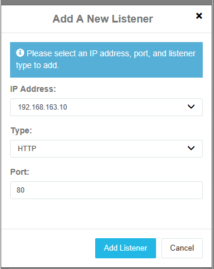

# POC - Cerberus

## 1. Introduction

Mise en place d'un serveur Cerberus sur un Windows Server 2012 R2

## 2. Prérequis

Une VM Windows Server 2012 R2.  
Rôles :
* Active Directory
* DNS

## 3. Installation de Cerberus

Le produit étant payant, une version d'essai est utilisé. Cette version d'essai dur 25 jours.

* Récupérer l'installateur sur https://www.cerberusftp.com/download/
* Executer l'installateur sur PRJS_SRV1
* Durant l'installation il sera demandé d'installer Visual C++
* Une fois l'installation terminée. Lancer Cerberus FTP Server
* Au démarrage de l'application, il sera demandé de configurer certain paramètres.
* Pour la license, choisir **For Personal, Home Use Only**
* Décocher **Create An Initial User**, les utilisateurs seront gérés via l'AD par la suite
* Activer la gestion web et choisir un mot de passe
* Cocher **Do Not Allow Unencrypted FTP**

## 4. Paramétrer Cerberus FTP Server

### 4.1. Activer l'authentification avec l'Active Directory

1. Se rendre dans le menu de configuration **Users** dans la barre menu en haut
2. Dans le menu gauche, sélectionner AD Users
3. Cocher **Enable Windows Authentification for this Domain**
4. Remplir le champ **Domain** par **PRJS.ch** et cliquer sur **Verify**
5. Dans **Default Group and Directory Mapping for AD Users**, sélectionner **Global Home**
6. Créer un dossier "DATA" à la racine du disque C et dans le champ à droite de **Global Home** sélectionner le dossier DATA

### 4.2. Ports d'accès

Actuellement, l'accès aux services web est uniquement sur le port 443 en HTTPS. L'inconvénient à ça c'est qu'un certificat SSL est requis pour l'accès HTTPS. Nous allons donc rajouter le port 80 pour l'HTTP.

1. A droite dans **IP Listenenr**, cliquer sur **New**  

2. Sélectionner l'adresse IP **192.168.163.10** ainsi quel le type **HTTP** et le port **80**

## 5 Tester la connexion

### 5.1 Créer un nouvel utilisateur dans l'AD

1. Ouvrir la console de gestion AD
2. Dans User, ajouter un nouvel utilisateur
3.   
  * Nom complet : User1
  * Ouverture de session : User1
  * Définir un mot de passe

### 5.2 Se connecter depuis PRJS_CLI1 (web HTTP)

Tester la connexion au service web.

1. Sur PRJS_CLI1, ouvrir un navigateur web
2. Entrer l'adresse IP du serveur (192.168.163.10)
3. La page de connexion de Cerberus apparait, entrer les informations de login de l'utilisateur créé précdemment (User1)
4. La connexion réussi, on arrive sur le File Manager

Les utilisateurs peuvent à partir d'ici ajouter, supprimer ou télécharger des fichiers selon les droits NTFS appliqué sur les dossiers (C:\DATA)

### 5.3 Connexion FTP

Tester la connexion FTP.

1. Télécharger un client FTP (ex. FileZilla)
2. Indiquer l'hôte (192.168.163.10), l'utilisateur (User1) et sont mot de passe. Le port par défaut est le 21.  
  
3. Une fois connecté, on a accès aux fichiers.

## 6. Conclusion

Cerberus est un outils très puissant permettant un accès aux ressources de divers façon (web, FTP, SSH). Son installation est très rapide et facile à configurer.
